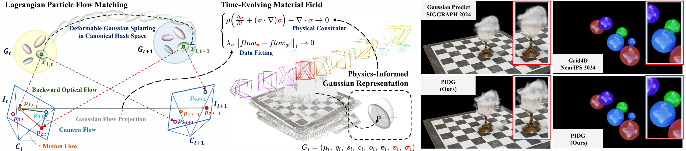
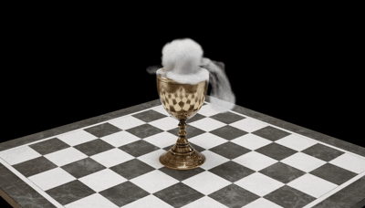
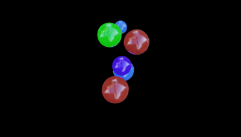
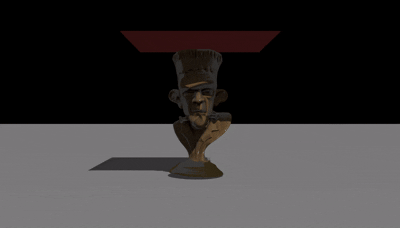

## Towards Unified Constitutive Laws for Time-Evolving Material Field

<p align="center">
  
  &nbsp;&nbsp;&nbsp;&nbsp;&nbsp;&nbsp;&nbsp;&nbsp;&nbsp;&nbsp;
  <br>
  <sub><b>¹ University of Science and Technology of China (USTC)</b> &nbsp;&nbsp;&nbsp;&nbsp;|&nbsp;&nbsp;&nbsp;&nbsp; <b>² University of Illinois Urbana-Champaign (UIUC)</b></sub>
<p>

**Authors:** Haoqin Hong†¹, Din Fan†¹, Fubing Dou¹, Zhili Zhou², Haoran Sun¹, Congcong Zhu‡¹, Jingrun Chen‡¹.  
<sub>†Equal contribution. ‡Corresponding author.</sub>


### Overview
This is the official code implementation of the paper "Physics-Informed Deformable Gaussian Splatting: Towards Unified Constitutive Laws for Time-Evolving Material Field". We will open source each module in stages and release the complete code and dataset after the paper is accepted.



### News

- PIDG is accepted by AAAI-26! See you in Singapore!
- Welcome to see more related cutting-edge research in [Awesome-Physics-Inspired-Vision-Understanding.](https://github.com/HaoqinHong/Awesome-Physics-Inspired-Vision-Understanding)


### Demo videos of dynamic reconstruction results from our PIDG method

**Representative Scenes: Dry Ice (Fluid Simulation), Balls Reaction (Elastic Mechanics) and Mechanics Cloth (Cloth Simulation)**

<p align="center">
  
  
  
</p>

## To do list:

- [X] Release Training Demo code.
- [X] Release Inference (rendering) code.
- [X] Release the network architecture (including 4D decomposed hash encoding with dynamic and static decoupling, physical information material fields, and Lagrangian particle flows).
- [X] Release CUDA/C++ optical-based rasteriser.
- [X] Release the representative subset of fluid simulation scenes. (compressed by approximately 30× into the WebP format.)
- [X] Release the dynamic reconstruction demo videos in representative scenes.
- [X] Release Training code.
- [ ] Release experimental analysis code (velocity field and material field visualisation, Gaussian particle centre distribution, Gaussian particle variation residual analysis).
- [ ] Release full PIDG custom physics-driven synthetic dataset. (due to double-blind review constraints and space limitations, we are currently unable to anonymously upload the dataset)


## Datasets

Our experiments employ three monocular datasets:


| Dataset       | Type                      | Scenes                           | Source               |
| --------------- | --------------------------- | ---------------------------------- | ---------------------- |
| **D-NeRF**    | Synthetic                 | 8, monocular                     | Official release     |
| **HyperNeRF** | Real-world dynamic        | 7, Subset of monocular sequences | Official release     |
| **PIDG**      | Synthetic, physics-driven | 5, Custom                        | Generated in Blender |

---

### HyperNeRF (Real-world)

1. **Geometry extraction:** Point clouds are reconstructed with COLMAP following the protocol in **E-D3DGS** *Per-Gaussian Embedding-Based Deformation for Deformable 3D Gaussian Splatting* (Bae *et al.*).
2. **Auxiliary supervision**


   | Quantity                 | Method                              | Checkpoint                              |
   | -------------------------- | ------------------------------------- | ----------------------------------------- |
   | Optical flow & occlusion | **UniMatch** (Xu *et al.*)          | `GMFlow-scale2-regrefine6-sintelft`     |
   | Motion mask              | **SAM-v2** (Ravi *et al.*)          | `sam2.1_hiera_large.pt`                 |
   | Depth map                | **Distill Any Depth** (He *et al.*) | `Distill-Any-Depth-Multi-Teacher-Large` |

   **File-format conventions**


   * Optical flow is stored in Middlebury`.flo` files.
   * Naming rule: *Forward* flow of frame *t* encodes motion **t → t + 1**;
   * *Backward* flow of frame *t* encodes motion **t → t − 1**.
3. For the HyperNeRF *vrig* scenes, we apply `./tools/hyper_filter.py` to filter the dataset such that only the left-view (monocular) images are retained for training, validation, and testing, without altering the original data split logic.

---

### PIDG (Synthetic)

Because learning-based models trained on real imagery perform poorly on synthetic PIDG data, alternative preprocessing is applied:


| Quantity     | Method                                                 |
| -------------- | -------------------------------------------------------- |
| Optical flow | Dual TV-L1 implementation in OpenCV                    |
| Motion mask  | Extracted from RGBA alpha channel (background → mask) |
| Depth map    | Same**Distill Any Depth** pipeline as for HyperNeRF    |

We use `./tools/dualtvl1.py` to extract the corresponding forward and backward optical flow between consecutive frames using the Dual TV-L1 algorithm. This script generates both `.flo` files for downstream processing and `.png` visualizations in HSV format for qualitative inspection.

---

### Directory layout (after preprocessing)

```
├── data
│   | HyperNeRF
│     ├── broom
│       ├── colmap
│       ├── rgb
│           ├── 2x
│               ├── left1_000000.png
│               ├── left1_000001.png
│               ├── ...
│       ├──flow 
│           ├── 2x
│               ├── left1_000000_flow_fwd.flo
│               ├── left1_000002_flow_fwd.flo
│               ├── left1_000002_flow_bwd.flo
│               ├── ...
│       ├──resized_mask 
│           ├── 2x
│               ├── left1_000000.png
│               ├── left1_000001.png
│               ├── ...
│       ├──depth-distill
│           ├── 2x
│               ├── left1_000000.npy
│               ├── left1_000001.npy
│               ├── ...
│     ├── split-cookie
│     ├── ...
│
│   | PIDG
│     ├── dry_ice
│       ├── train
│           ├── 0001.png
│           ├── 0002.png
│           ├── ...
│       ├──flows_flo
│           ├── flow_bwd_0002.flo
│           ├── flow_bwd_0003.flo
│           ├── ...
│       ├──motion_mask 
│           ├── 0000.png
│           ├── 0001.png
│           ├── ...
│       ├──depth-distill
│           ├── 0001.npy
│           ├── 0002.npy
│           ├── ...
│     ├── balls-reaction
│     ├── ...
```

### Network Architecture Navigation
**Section A: Dynamic-Static Decoupled 4D Hash Encoding**: ./hashencoder & ./train_pidg.py & ./scene_PIDG/gaussian_model.py and so on.

**Section B: Physics-Informed Gaussian Representation**: ./motion_utils/time_evolving_material_field.py  & ./scene_PIDG/gaussian_model.py & ./scene_PIDG/deform_model.py & ./train_pidg.py and so on. 

**Section C: Lagrangian Particle Flow Matching**：./submodules/flow-based-diff-gaussian-rasterization & ./utils/flow_utils.py & ./utils/flow_vis_utils.py and so on.

